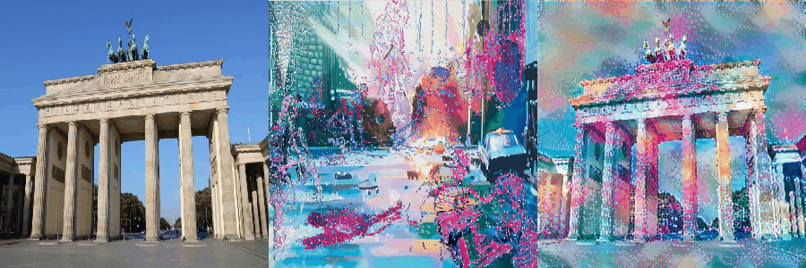

# NeuralStyleTransferVGG16
Based on "A Neural Algorithm of Artistic Style" by Gatys et al.

A technique that composes the content of an image with the style of another. The output looks like the original image painted in the style of the second image.

The content and style information are extracted using a deep convolution network. The output image is kept close to the two input images by defining optimizing the losses and applying regularization. 

Adapted from: [Style Transfer - Styling Images with Convolutional Neural Networks](https://towardsdatascience.com/style-transfer-styling-images-with-convolutional-neural-networks-7d215b58f461)

<h3 align="center">
  
</h3>
